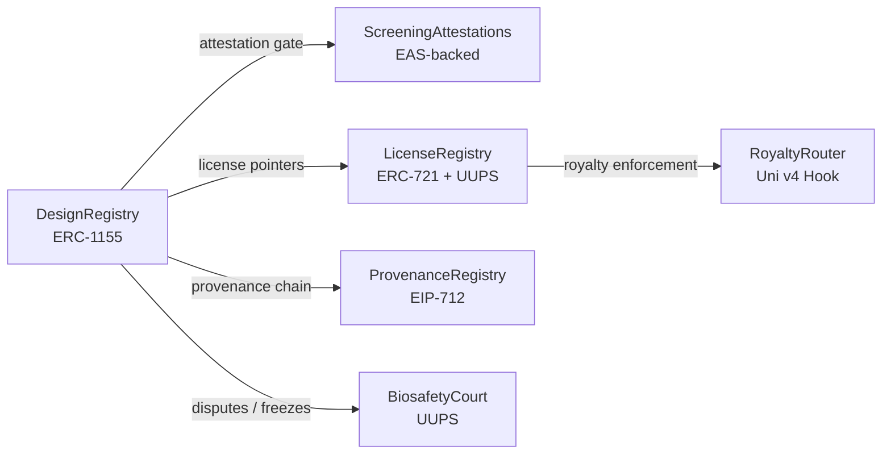

# Seqora

**SBOL-native, royalty-enforcing on-chain registry for engineered DNA designs.**

[](LICENSE)
[](https://github.com/SeqoraBase/seqora/actions/workflows/ci.yml)
[](https://soliditylang.org/)
[](https://base.org/)
[](#)

## What is Seqora

Synthetic biology designs lack composable, on-chain IP infrastructure. Researchers share plasmids and gene circuits through centralized repositories with no enforceable licensing, no provenance tracking, and no mechanism for downstream royalties. Seqora fixes this by registering SBOL3-compliant designs as ERC-1155 tokens on Base L2, attaching Story Protocol-compatible licenses, enforcing royalty splits via Uniswap v4 hooks at the point of swap, and gating registration behind staked biosafety reviewer bonds. The result is a permissionless registry where every fork, every license, and every royalty payment is traceable on-chain.

## Architecture



## Quick Start

Prerequisites: [Foundry](https://getfoundry.sh/), Git.

```bash
git clone --recursive https://github.com/SeqoraBase/seqora.git
cd seqora/contracts
forge build
forge test
```

## Contracts

| Contract | Type | Description |
|---|---|---|
| DesignRegistry | ERC-1155 (immutable) | Tokenizes SBOL3 designs. Content-addressed, fork-tracked. |
| ScreeningAttestations | Ownable2Step | EAS-backed biosafety attestation gate. |
| LicenseRegistry | ERC-721 + UUPS | Story Protocol-compatible license NFTs with PIL flags. |
| RoyaltyRouter | IHooks (Uni v4) | EIP-2981 + Uniswap v4 hook enforcing royalty splits at swap. |
| ProvenanceRegistry | EIP-712 (immutable) | Signed model cards + wet-lab attestations for chain of custody. |
| BiosafetyCourt | UUPS | Kleros-style disputes, staked reviewer bonds, Safety Council freeze. |

## Project Structure

```
seqora/
├── contracts/          Foundry project — production contracts, tests, scripts
│   ├── src/            6 v1 Solidity contracts
│   ├── test/           Full test suites (517 tests)
│   ├── script/         Deployment scripts
│   └── foundry.toml    Forge configuration
├── frontend/           Next.js + wagmi + Farcaster Mini App (coming soon)
├── .github/            CI workflows, issue templates, PR template
├── CONTRIBUTING.md     Contribution guide
├── SECURITY.md         Vulnerability disclosure policy
├── CODE_OF_CONDUCT.md  Contributor Covenant v2.1
└── LICENSE             MIT
```

## Development

See [CONTRIBUTING.md](CONTRIBUTING.md) for the full contribution workflow.
See [contracts/README.md](contracts/README.md) for the detailed Solidity development guide.

## Security

See [SECURITY.md](SECURITY.md) for the vulnerability disclosure policy.

Audit reports generated during development are available on request. Contact security@seqorabase.com.

## Roadmap

**v1 (current):** Design registration, SBOL3 content-addressing, Story Protocol-compatible licensing, Uniswap v4 royalty enforcement, EAS-backed biosafety attestation gate, Kleros-style dispute resolution.

**v2 (planned):** Proof-of-synthesis verification, ZK-screening for biosafety, AI BioAgent API for programmatic design submission and querying.

## License

[MIT](LICENSE)

## Links

- [Discord](#)
- [Twitter](#)
- [Documentation](#)
